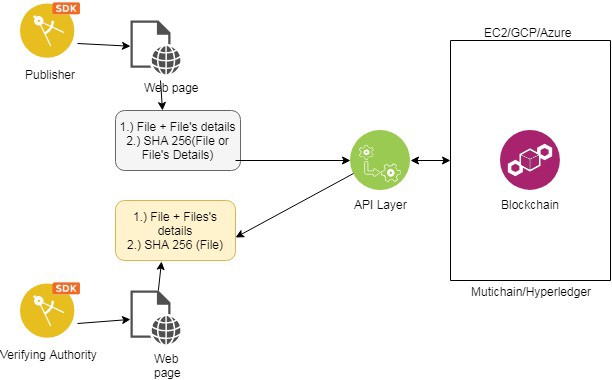
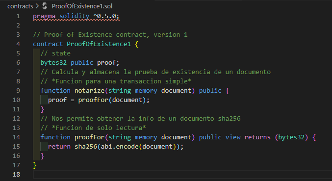
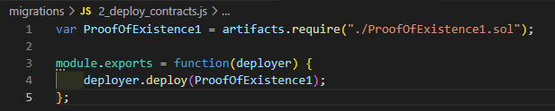
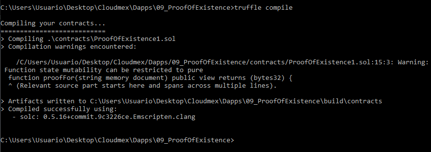

# SMART CONTRACTS # Solidity #Truffle 

Para esta practica se creara una proof of existence, esto es un servicio online que verifica la existencia de archivos via timestamp en blockchain.

Por lo que comenzamos en cmd ubicando la direccion donde crearemos nuestro proyecto y una vez localizados ahi ejecutaremos el comando "truffle init" para generar los archivos basicos, despues crearemos nuestro archivo del contrato en la carpeta "contracts" el cual contendra el codigo de nuestro contrato de POE:

Este es un codigo basico de POE, el cual nos permite almacenar en memoria una transaccion a modo de documento de 32 bytes y consultar que realmente se haya guardado el documento.

Por ultimo creamos un deploy el cual guardaremos en la carpeta "migrations" en la cual el nuevo archivo se llamada "2_deploy_contracts.js" el cual solo manda a llamar la info de nuestro archivo .sol que contiene el contrato, para poderlo migrar una vez se haya compilado correctamente.

Verificamos que se compila correctamente con el comando "truffle compile"

De esta manera hemos creado un contrato que demuestra la existencia de archivos, para migrar solo se adapta a donde se desee como Ganache o bien crear un test para que sea local.

Tutorial original : https://blog.openzeppelin.com/the-hitchhikers-guide-to-smart-contracts-in-ethereum-848f08001f05/

